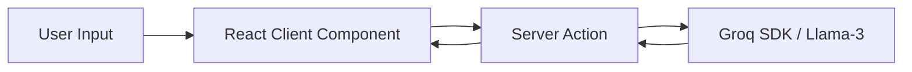

# System Architecture (`ARCHITECTURE.md`)

High-level map of the `freeviralkit` application architecture, service boundaries, data flows, and tech stack components.

---

## 🏗️ Core Tech Stack

* **Framework**: Next.js 16 (App Router)
* **Frontend**: React 19, Tailwind CSS v4, Lucide React icons, Framer Motion
* **Server Logic**: Next.js Server Actions (`src/app/actions/`)
* **AI & LLM Services**: `groq-sdk` (Llama-3 model inferences)
* **Live Search & Real-Time Context**: Wikipedia REST API & DuckDuckGo (`duck-duck-scrape`)
* **Database & Caching**: Upstash Redis (`@upstash/redis`), PostgreSQL (`pg`)
* **Telemetry**: `@vercel/analytics`, `@vercel/speed-insights`

---

## 📁 System Components & Directory Layout

```
├── src/
│   ├── app/                         # App Router Pages & API Routes
│   │   ├── actions/                 # Server Actions for AI generation & search
│   │   │   ├── realtimeTitles.ts    # Real-time search context & title generator
│   │   │   └── ...
│   │   ├── youtube-realtime-title-generator/ # Dedicated Real-time Generator Tool Page
│   │   ├── sitemap.ts               # Dynamic sitemap generation
│   │   └── ...
│   ├── components/                  # React UI Components
│   │   ├── tools/                   # Interactive tool client views
│   │   │   ├── RealTimeGeneratorClient.tsx
│   │   │   ├── TitleGeneratorClient.tsx
│   │   │   └── ...
│   │   ├── Footer.tsx               # Global footer (includes CodeTrendy badge)
│   │   └── RelatedTools.tsx         # Cross-tool navigation links
│   └── lib/                         # Core Utilities & External Services
│       └── liveSearchContext.ts     # Wikipedia + DuckDuckGo live data search logic
├── scripts/                         # Offline Node.js test & helper scripts (Excluded from deployment)
├── AGENTS.md                        # Master AI Agent rules & workflow guidelines
├── CONSTRAINTS.md                   # Strict operational guardrails & boundary rules
├── DECISIONS.md                     # Architectural decision log
├── HANDOVER.md                      # Session handoff & status state
└── task.md                          # Active task & subtask tracking log
```

---

## 🔄 Data & Execution Flow

### 1. Standard AI Generation Flow


### 2. Live Real-Time & Movie Generator Flow

```mermaid
graph TD
    User[User Search Query] --> Client[RealTimeGeneratorClient.tsx]
    Client --> Action[realtimeTitles.ts Action]
    Action --> Search[liveSearchContext.ts]
    Search --> Wiki[Wikipedia REST API]
    Search --> DDG[DuckDuckGo Scraping]
    Wiki --> Combined[Unified Live Context]
    DDG --> Combined
    Combined --> GroqPrompt[LLM Prompt with Context]
    GroqPrompt --> Groq[Groq API]
    Groq --> ParsedJSON[Structured Titles, Tags, Descriptions]
    ParsedJSON --> Client
```


---

## 🔒 Security & Deployment Boundaries

* **Public Web Scope**: Everything inside `src/` is built into the Next.js bundle.
* **Private Offline Scope**: Anything inside `scripts/` is strictly local/offline testing scripts and must never be exposed to public web routing to safeguard AdSense compliance.
