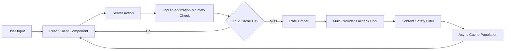
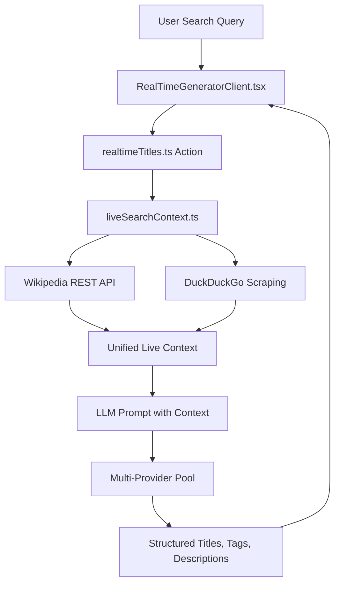
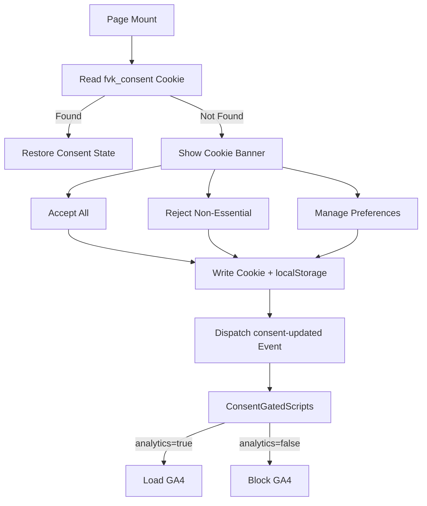

# System Architecture (`ARCHITECTURE.md`)

High-level map of the `freeviralkit` application architecture, service boundaries, data flows, and tech stack components.

---

## 🏗️ Core Tech Stack

* **Framework**: Next.js 16.2.4 (App Router, Turbopack)
* **Frontend**: React 19, Tailwind CSS v4, Lucide React icons, Framer Motion
* **Server Logic**: Next.js Server Actions (`src/app/actions/`)
* **AI & LLM Services**: Multi-provider fallback pool — Groq SDK (Llama-3), Google Gemini (REST), Cloudflare Workers AI, OpenRouter, Cerebras, Together AI
* **Live Search & Real-Time Context**: Wikipedia REST API & DuckDuckGo (`duck-duck-scrape`)
* **Database & Caching**: Upstash Redis (`@upstash/redis`) for L2 distributed cache + rate limiting, Neon PostgreSQL (`pg`) for blog posts
* **Content Safety**: `src/lib/content-safety.ts` — server-side keyword blocklist, pattern detection, HTML sanitization
* **GDPR Consent**: `ConsentProvider` + `ConsentGatedScripts` — three-category consent (Essential / Analytics / Advertising)
* **Telemetry**: `@vercel/analytics`, `@vercel/speed-insights`, GA4 (consent-gated)

---

## 📁 System Components & Directory Layout

```
├── src/
│   ├── app/                           # App Router Pages & API Routes
│   │   ├── actions/                   # 17 Server Actions for AI generation
│   │   │   ├── core.ts                # Universal AI Orchestrator (cache, rate-limit, safety, fallback)
│   │   │   ├── titles.ts              # Title generator (5 niche archetypes)
│   │   │   ├── descriptions.ts        # YouTube Studio-format descriptions
│   │   │   ├── hashtags.ts            # 3-tier mobile-priority hashtags
│   │   │   ├── tags.ts                # 4-tier discovery tags (<480 chars)
│   │   │   ├── hooks.ts               # Dual visual+audio retention hooks
│   │   │   ├── scripts.ts             # Full production script outlines
│   │   │   ├── chapters.ts            # Google Key Moments timestamps
│   │   │   ├── thumbnails.ts          # High-CTR thumbnail concepts
│   │   │   ├── channelNames.ts        # <15-char @handle-friendly names
│   │   │   ├── shorts.ts              # 9:16 Shorts scripts
│   │   │   ├── research.ts            # Topic & search intent researcher
│   │   │   ├── seoGrader.ts           # SEO score grader
│   │   │   ├── realtimeTitles.ts      # Live movie/trending context generator
│   │   │   ├── abTest.ts              # 3-way A/B test pack generator
│   │   │   ├── details.ts             # Homepage details package
│   │   │   └── queueActions.ts        # Queue management
│   │   ├── youtube-ab-test-generator/ # A/B Test Generator Tool Page
│   │   ├── youtube-realtime-title-generator/ # Real-time Movie Generator
│   │   ├── tools/                     # 18 Niche programmatic SEO pages
│   │   ├── blog/                      # Blog system (Neon PostgreSQL-backed)
│   │   │   ├── data.ts                # DB queries with static fallback
│   │   │   └── [slug]/page.tsx        # Dynamic blog post pages
│   │   ├── about/, contact/, creator-gear/, privacy-policy/, terms/, disclaimer/
│   │   ├── sitemap.ts                 # Dynamic sitemap (static + blog)
│   │   └── robots.ts                  # Robots.txt with crawl rules
│   ├── components/                    # React UI Components
│   │   ├── tools/                     # Interactive tool client views (15 clients)
│   │   ├── tools/niche/               # Niche studio clients (Anime, ASMR, AI&Tech, etc.)
│   │   ├── tools/hooks/               # Hook generator sub-components
│   │   ├── tools/ab-test/             # A/B test sub-components
│   │   ├── tools/home/                # Homepage tool sub-components
│   │   ├── home/                      # Homepage sections (FAQ, Blog, SEO, QuickAccess)
│   │   ├── about/                     # About page sections (Founder, Values, FAQ)
│   │   ├── gear/                      # Creator gear page sections
│   │   ├── tools-hub/                 # Tools directory components
│   │   ├── ConsentProvider.tsx         # GDPR consent context & cookie management
│   │   ├── ConsentGatedScripts.tsx     # Dynamically loads GA4 on consent grant
│   │   ├── CookieBanner.tsx           # 3-category consent UI banner
│   │   ├── AdSense.tsx                # Ad unit wrapper components
│   │   ├── Navbar.tsx                 # Global navigation
│   │   ├── Footer.tsx                 # Global footer (includes CodeTrendy badge)
│   │   └── RelatedTools.tsx           # Cross-tool navigation links
│   ├── data/                          # Static data & catalog registries
│   │   ├── toolsCatalog.ts            # 33 tools (15 core + 18 niche)
│   │   ├── aboutData.ts               # About page stats, values, FAQ
│   │   └── homeData.ts                # Homepage FAQ & content
│   └── lib/                           # Core Utilities & External Services
│       ├── ai/                        # AI infrastructure layer
│       │   ├── providers/             # Provider implementations
│       │   │   ├── factory.ts         # Provider factory & selection
│       │   │   ├── groq.ts            # Groq SDK provider
│       │   │   ├── gemini.ts          # Google Gemini REST provider
│       │   │   ├── cloudflare.ts      # Cloudflare Workers AI provider
│       │   │   └── types.ts           # Provider interface types
│       │   ├── providers.ts           # generateWithFallback() orchestrator
│       │   ├── cache.ts               # L1 in-memory + L2 Redis semantic cache
│       │   ├── circuitBreaker.ts      # Provider circuit breaker
│       │   ├── rateLimiter.ts         # Sliding-window rate limiter
│       │   ├── validation.ts          # Input sanitization & prompt injection defense
│       │   ├── parsers.ts             # Safe JSON/array/object parsers
│       │   └── webGrounding.ts        # Tavily + Wikipedia + DDG search
│       ├── content-safety.ts          # AdSense-compliant content moderation
│       ├── liveSearchContext.ts       # Wikipedia + DDG live data search
│       ├── site.ts                    # Site config & URL builders
│       ├── ad-slots.ts                # Ad slot configuration
│       ├── queue.ts                   # Queue utility
│       ├── source-history.ts          # Git-based last-modified dates for sitemap
│       └── useCopyToClipboard.ts      # Client hook for clipboard
├── scripts/                           # Offline Node.js test & helper scripts (excluded from deployment)
├── AGENTS.md                          # Master AI Agent rules & workflow guidelines
├── ARCHITECTURE.md                    # This file — system architecture map
├── CONSTRAINTS.md                     # Strict operational guardrails
├── DECISIONS.md                       # Architectural decision log
├── HANDOVER.md                        # Session handoff & status state
└── task.md                            # Active task & subtask tracking log
```

---

## 🔄 Data & Execution Flow

### 1. Standard AI Generation Flow


### 2. Live Real-Time & Movie Generator Flow


### 3. GDPR Consent & Script Loading Flow


---

## 🔒 Security & Deployment Boundaries

* **Public Web Scope**: Everything inside `src/` is built into the Next.js bundle.
* **Private Offline Scope**: Anything inside `scripts/` is strictly local/offline testing scripts and must never be exposed to public web routing.
* **Content Safety**: All AI output passes through `filterAIOutput()` before reaching users. All user input passes through `checkInputSafety()` + `sanitizeAndValidateInput()`.
* **GDPR Compliance**: GA4 is consent-gated. AdSense auto-ads load unconditionally for Google reviewer verification.
* **Rate Limiting**: Sliding-window rate limiter via Upstash Redis protects against API abuse.
