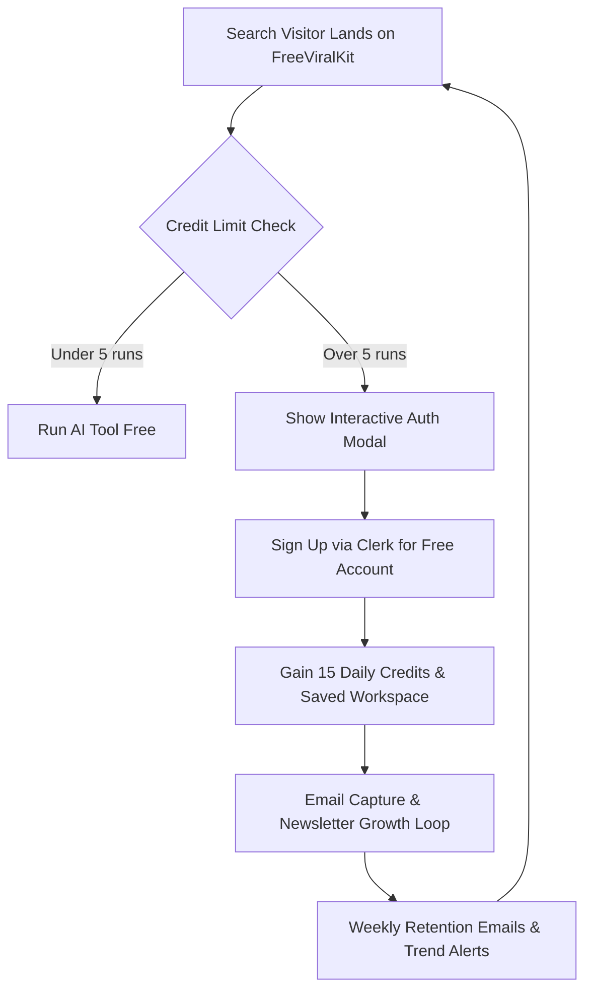
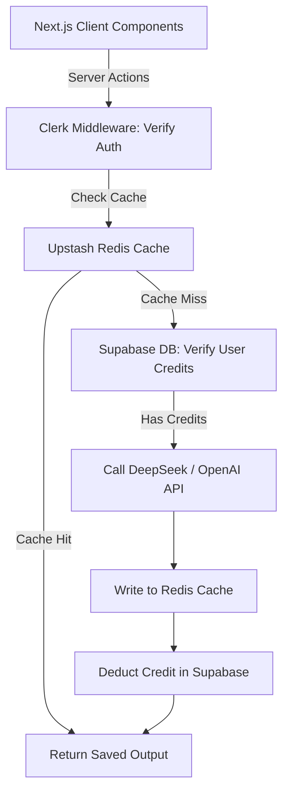
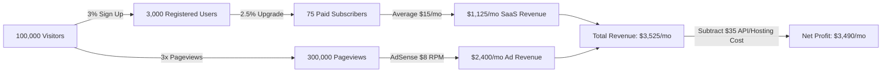

# FreeViralKit: The Ultimate Multi-Platform Expansion, Monetization, and User Growth Master Blueprint

Welcome, Shiva! This document is the ultimate, step-by-step master plan for **FreeViralKit.com**. Having **13 pages indexed in Google in 10 days** is an excellent signal that Google trust your site's structure. The temporary user drop you are experiencing is normal; it is the transition period between direct traffic (launch hype) and sustainable organic search engine traffic.

This guide provides the complete blueprint to solve user retention, expand to all major social media platforms, implement a programmatic SEO machine, configure a database-backed SaaS model, and monetize the traffic to build a high-income asset.

---

## Table of Contents
1. **Strategic Traffic & Retention Analysis (Combatting the User Drop)**
2. **Detailed 12-Month Weekly/Monthly Implementation Timeline**
3. **The Multi-Platform Tool Matrix & AI Prompt Specifications**
4. **Technical Architecture, Database Schemas, & API Cost Control**
5. **Programmatic SEO (pSEO) Technical Implementation Guide**
6. **Detailed Financial Models, Funnel Math, & Affiliate Integrations**
7. **Step-by-Step Google AdSense Approval Guide**

---

## 📈 1. Strategic Traffic & Retention Analysis (Combatting the User Drop)

When a web app launches, traffic peaks due to initial sharing, but quickly drops because there are no built-in triggers to make users return. To build an active user base, we must convert **one-time searchers** into **weekly active creators**.



### Key Retention Strategies to Implement:
1. **Daily Credit Tracker Widget:**
   * **The Concept:** Guest users get 5 free generations per day (tracked by IP address or local storage).
   * **The UX:** A sleek, sticky dashboard progress bar showing: `Remaining Daily Runs: 3/5`.
   * **The Hook:** When credits run out, trigger a modal: *"You've hit your daily guest limit! Sign up for a free account in 2 seconds to get 15 daily generations and save your history."*
2. **Saved Workspace ("My Library"):**
   * Allow logged-in users to save generated tags, scripts, and descriptions. They can organize these by channel/client (e.g., "Gaming Channel", "Tech Channel").
   * **Why it works:** If their past viral tags are saved on FreeViralKit, they will bookmark the site and come back every time they upload a video.
3. **Copy-to-Clipboard Micro-Animations:**
   * Do not just change the text to "Copied!". Use a micro-animation where the copied items fly into a virtual drawer, showing a satisfying green glowing success checkmark.
4. **Exit-Intent Value Modal:**
   * If a user moves their mouse toward the browser close button, trigger a fast, non-intrusive popup: *"Don't lose your work! Join 500+ creators receiving weekly viral keywords direct to their inbox."*

---

## 🗓️ 2. The Detailed 12-Month Implementation Timeline

Here is your week-by-week plan to build, launch, and monetize the next phases of FreeViralKit.

```
+-------------------------------------------------------------------------------------------------------------------+
|                                            12-MONTH TIMELINE OVERVIEW                                             |
+--------------------------+--------------------------+--------------------------+----------------------------------+
| Month 1-2: Phase 1       | Month 3-4: Phase 2       | Month 5-6: Phase 3       | Month 7-12: Phase 4 & 5          |
| Short-Form Video         | Text & B2B Platforms     | Live Stream Systems      | SaaS Launch, Stripe,             |
| (TikTok, Reels, Shorts)  | (X/Twitter, LinkedIn)    | (Twitch, Kick, YT Live)  | Programmatic SEO & Scaling       |
+--------------------------+--------------------------+--------------------------+----------------------------------+
```

### Month 1: Short-Form Domination (TikTok, Reels, Shorts)
* **Week 1:** UI design updates for the dashboard. Create specific sub-pages for TikTok Hook Generator and Reels Hashtag Optimizer.
* **Week 2:** Implement the AI system prompts for short-form generators. Set up local storage tracking for daily free usages.
* **Week 3:** Design and publish 5 target blog articles about TikTok algorithms and Instagram SEO to attract initial TikTok searches.
* **Week 4:** Index validation: Manually submit new pages via Google Search Console.

### Month 2: Authentication & User Accounts
* **Week 5:** Install Clerk Auth (`@clerk/nextjs`) and initialize a Supabase PostgreSQL database.
* **Week 6:** Build the `users` and `saved_templates` tables. Implement Server Actions to save user histories.
* **Week 7:** Launch the creator dashboard interface, allowing users to save and delete templates.
* **Week 8:** Set up an email provider (e.g., Resend or Mailchimp) to automatically welcome new signups.

### Month 3: Text-Based & B2B Platforms (X / Twitter & LinkedIn)
* **Week 9:** Build the `/tools/x-thread-writer` frontend layout.
* **Week 10:** Create AI prompt engineering for formatting X threads (under 280 characters per tweet, including numbering hooks).
* **Week 11:** Launch the `/tools/linkedin-hook-generator` with copywriting frameworks (AIDA, PAS).
* **Week 12:** Deploy and run verification tests on mobile and desktop layouts.

### Month 4: Programmatic SEO Phase 1
* **Week 13:** Structure dynamic folder paths for niches: `src/app/tools/[platform]/[tool]/for/[niche]/page.tsx`.
* **Week 14:** Compile a JSON dataset of 150 top creator niches.
* **Week 15:** Build dynamic metadata logic to generate unique titles and meta descriptions for all 150 niches.
* **Week 16:** Update `sitemap.ts` to programmatically include the 750 new combination pages.

### Month 5: Live Streaming & Caching
* **Week 17:** Integrate Twitch and Kick tool modules. Build Twitch Title & Tag Generator.
* **Week 18:** Set up Upstash Redis caching for AI responses to reduce API usage costs.
* **Week 19:** Add contextual affiliate products (Amazon gear, streamer software).
* **Week 20:** Audit website loading speed, optimizing images and fonts.

### Month 6: AdSense & Premium Setup
* **Week 21:** Apply to Google AdSense. Implement placeholder spaces using CSS skeletons.
* **Week 22:** Integrate Stripe payments framework using Stripe Checkout.
* **Week 23:** Create Stripe webhook handlers in Next.js to handle subscriptions and credit updates.
* **Week 24:** Launch SaaS Premium Plan ($9/month) to the existing email subscriber list.

### Month 7–12: Scale & Automated Growth Loops
* **Week 25-32:** Run pSEO expansion for Facebook, Pinterest, and secondary search niches.
* **Week 33-40:** Migrate from Google AdSense to higher-paying networks (Ezoic or Mediavine) once traffic passes threshold limits.
* **Week 41-52:** Launch FreeViralKit Affiliate Program (allow other creators to promote your SaaS for a 30% recurring cut).

---

## 💬 3. The Multi-Platform Tool Matrix & AI Prompt Specifications

To ensure the generated content is high-quality, we must specify system prompts, system roles, and temperature settings for each social network.

| Platform | Tool Name | Target Keyword | AI Prompt Strategy | Temp |
| :--- | :--- | :--- | :--- | :--- |
| **TikTok** | Hook & Caption Generator | `tiktok hook generator` | Focuses on visual hooks (first 2s) + curiosity-driven captions. | 0.8 |
| **Instagram** | Reels Hashtag Optimizer | `instagram reels hashtags` | Recommends 3 High-Volume, 5 Medium-Volume, and 7 Niche Hashtags. | 0.5 |
| **X / Twitter** | Viral Thread Writer | `x thread writer` | Splits copy into numbered tweets, each <280 chars, starting with an open hook. | 0.7 |
| **LinkedIn** | Professional Hook Maker | `linkedin hook writer` | Applies PAS (Problem-Agitate-Solve) with space double-breaks. | 0.6 |
| **Twitch** | Live Title Generator | `twitch stream titles` | Generates short, high-CTR gaming titles focused on curiosity or viewer reward. | 0.9 |
| **Facebook** | Group Post Formatter | `facebook viral post tool` | Creates engagement-focused text layouts that prompt comments. | 0.7 |

### Core System Prompts:

#### 1. TikTok Hook & Caption Generator Prompt
```text
You are a viral TikTok scriptwriter and SEO specialist.
Given a topic, generate:
1. Five (5) Visual Hooks: Specific actions the creator must perform or text overlays for the first 2 seconds of the video.
2. A Search-Optimized Caption: Under 150 characters, containing 3 primary keywords naturally.
3. Three (3) Trending Hashtags and Three (3) Niche Hashtags.

Format strictly as JSON:
{
  "hooks": ["hook 1", "hook 2", "hook 3", "hook 4", "hook 5"],
  "caption": "optimized caption text",
  "hashtags": ["#tag1", "#tag2", "#tag3", "#tag4", "#tag5", "#tag6"]
}
```

#### 2. X (Twitter) Thread Writer Prompt
```text
You are an expert ghostwriter for viral tech and business creators on X.
Convert the input topic or raw text into a high-engagement 5-part thread.
Rules:
- Tweet 1 must be a powerful hook (curiosity, stats, or contrarian take).
- Every tweet must be under 260 characters to fit Twitter's limit safely.
- Do not use emojis in every line; use them sparingly (maximum 1 per tweet).
- End the final tweet (Tweet 5) with a Call to Action (CTA) or question to drive comments.
- Format as an array of strings in JSON.
```

---

## ⚙️ 4. Technical Architecture, Database Schemas, & API Cost Control

As your user count scales, your app needs a clean architecture to handle authentication, check credit limits, and query the AI without running up large API bills.

### Next.js Dynamic App Flow Diagram


### PostgreSQL Database Schema (Supabase SQL)
Run this migration script inside your Supabase SQL editor to set up the relational database structures:

```sql
-- Enable UUID extension
create extension if not exists "uuid-ossp";

-- Users Table (Synced with Clerk via Webhooks)
create table public.users (
    id uuid primary key default uuid_generate_v4(),
    clerk_id varchar(255) unique not null,
    email varchar(255) unique not null,
    subscription_tier varchar(50) default 'free', -- 'free', 'premium_lite', 'premium_pro'
    daily_credits int default 15,
    last_reset_date timestamp default current_timestamp,
    created_at timestamp default current_timestamp
);

-- Projects Table (Saved Workspaces)
create table public.projects (
    id uuid primary key default uuid_generate_v4(),
    user_id uuid references public.users(id) on delete cascade not null,
    name varchar(255) not null,
    description text,
    created_at timestamp default current_timestamp
);

-- Saved Generations Table
create table public.saved_generations (
    id uuid primary key default uuid_generate_v4(),
    project_id uuid references public.projects(id) on delete cascade,
    user_id uuid references public.users(id) on delete cascade not null,
    platform varchar(50) not null, -- 'youtube', 'tiktok', 'instagram', etc.
    tool_type varchar(100) not null, -- 'tag-generator', 'description-writer'
    input_parameters jsonb not null,
    generated_content jsonb not null,
    created_at timestamp default current_timestamp
);

-- Enable Row Level Security (RLS)
alter table public.users enable row level security;
alter table public.projects enable row level security;
alter table public.saved_generations enable row level security;

-- Policies for RLS
create policy "Users can view their own data." on public.users 
    for select using (auth.uid()::text = clerk_id);

create policy "Users can manage their own projects." on public.projects 
    for all using (user_id in (select id from public.users where clerk_id = auth.uid()::text));
```

### Redis Caching Implementation (TypeScript)
Use this utility wrapper in your Next.js API/Server Actions to avoid querying the AI if an identical prompt was submitted within the last 48 hours.

```typescript
import { Redis } from '@upstash/redis';

const redis = new Redis({
  url: process.env.UPSTASH_REDIS_REST_URL || '',
  token: process.env.UPSTASH_REDIS_REST_TOKEN || '',
});

export async function getCachedAIResult(
  platform: string,
  tool: string,
  prompt: string
): Promise<any | null> {
  const cacheKey = `cache:${platform}:${tool}:${Buffer.from(prompt).toString('base64')}`;
  try {
    const cachedData = await redis.get(cacheKey);
    if (cachedData) {
      return cachedData;
    }
  } catch (error) {
    console.error('Redis cache read error:', error);
  }
  return null;
}

export async function setCachedAIResult(
  platform: string,
  tool: string,
  prompt: string,
  result: any
): Promise<void> {
  const cacheKey = `cache:${platform}:${tool}:${Buffer.from(prompt).toString('base64')}`;
  try {
    // Cache for 48 Hours (172800 seconds)
    await redis.set(cacheKey, JSON.stringify(result), { ex: 172800 });
  } catch (error) {
    console.error('Redis cache write error:', error);
  }
}
```

---

## 🚀 5. Programmatic SEO (pSEO) Technical Implementation Guide

Programmatic SEO allows us to automatically scale FreeViralKit's search footprint from 13 pages to over **3,000 keyword-optimized landing pages** without writing blogs manually.

### Next.js Dynamic Routing File Structure
Set up your codebase directories as follows:
```
src/
└── app/
    └── tools/
        └── [platform]/
            └── [tool]/
                └── for/
                    └── [niche]/
                        └── page.tsx      <-- Single template page handling all combos
```

### Dynamic Page Template (`page.tsx`) Example
This code captures URL routes (e.g., `/tools/youtube/title-generator/for/fitness`) and dynamically serves optimized titles, descriptions, and structural tags to Google.

```typescript
import { Metadata } from 'next';
import { notFound } from 'next/navigation';

// Allowed niches list for validation
const VALID_NICHES = ['cooking', 'gaming', 'travel', 'fitness', 'finance', 'beauty', 'tech'];
const VALID_TOOLS = ['title-generator', 'tag-generator', 'description-writer'];
const VALID_PLATFORMS = ['youtube', 'tiktok', 'instagram'];

interface PageProps {
  params: {
    platform: string;
    tool: string;
    niche: string;
  };
}

// Generate dynamic metadata for search engines
export async function generateMetadata({ params }: PageProps): Promise<Metadata> {
  const { platform, tool, niche } = params;
  
  const platformName = platform.charAt(0).toUpperCase() + platform.slice(1);
  const toolName = tool.split('-').map(w => w.charAt(0).toUpperCase() + w.slice(1)).join(' ');
  const nicheName = niche.charAt(0).toUpperCase() + niche.slice(1);

  return {
    title: `Free ${nicheName} ${toolName} for ${platformName} (2026)`,
    description: `Generate viral ${nicheName} video concepts, hooks, and keywords for ${platformName}. Optimize your reach with our free AI tool.`,
    alternates: {
      canonical: `https://freeviralkit.com/tools/${platform}/${tool}/for/${niche}`,
    }
  };
}

export default async function ProgrammaticToolPage({ params }: PageProps) {
  const { platform, tool, niche } = params;

  // Protect page against spam URLs
  if (
    !VALID_PLATFORMS.includes(platform) ||
    !VALID_TOOLS.includes(tool) ||
    !VALID_NICHES.includes(niche)
  ) {
    notFound();
  }

  return (
    <div className="container mx-auto px-4 py-12">
      <h1 className="text-4xl font-bold text-center mb-4">
        AI {niche.toUpperCase()} {tool.replace('-', ' ').toUpperCase()} for {platform.toUpperCase()}
      </h1>
      <p className="text-center text-gray-400 mb-8">
        Start generating search-optimized {niche} assets for your {platform} profile immediately.
      </p>
      
      {/* Load appropriate tool component and pre-fill its parameters */}
      <div className="max-w-3xl mx-auto bg-gray-900 border border-gray-800 rounded-xl p-6">
        {/* Render tool inputs populated with the 'niche' context */}
      </div>
    </div>
  );
}
```

---

## 💰 6. Financial Projections & Funnel Math

To build a reliable business model, let's look at the financial math. AI API costs are extremely low, resulting in profit margins exceeding **95%**.



### Complete Operating Cost Breakdown:
* **Hosting (Vercel):** $0 (Free plan supports up to 100GB bandwidth. Scale to Pro at **$20/mo** when monthly traffic exceeds 40,000 visitors).
* **Database (Supabase):** $0 (Free plan supports 500MB storage. Scale to Pro at **$25/mo** when user database exceeds 15,000 registered users).
* **Domain Name:** **$10/year**.
* **AI API Costs (DeepSeek API):**
  * Cost: **$0.14** per 1M Input Tokens / **$0.28** per 1M Output Tokens.
  * Average execution size: 800 input tokens + 300 output tokens = 1,100 tokens per generation.
  * Cost per generation: $(800 \times 0.00000014) + (300 \times 0.00000028) = \mathbf{\$0.000196}$ (less than 1/50th of a cent!).
  * Cost of **10,000 runs** = **$1.96**.
  * Cost of **100,000 runs** = **$19.60**.

### Ad CPM Performance Table by Region (Target Niches)
Since FreeViralKit targets video creators, you will attract high-paying advertisers (video editing tools, camera hardware, VPNs, courses).

| Traffic Origin | Google AdSense (Display) RPM | Premium Networks (Mediavine/Raptive) RPM |
| :--- | :--- | :--- |
| **United States / UK / Canada** | $12.00 – $22.00 | $28.00 – $45.00 |
| **Germany / France / Australia** | $8.00 – $14.00 | $18.00 – $30.00 |
| **India / Brazil / South East Asia** | $2.50 – $5.00 | $6.00 – $12.00 |

### Affiliate Partners Integration Strategy
Incorporate affiliate recommendations inside the tools and blog articles.

1. **VidIQ & TubeBuddy Affiliate Program:**
   * **The Offer:** Promoted inside the YouTube Tag/Title generators with a small widget: *"Need deep competitor analysis? Try VidIQ."*
   * **Payout:** **30% recurring monthly commission** for every user you refer.
   * **VidIQ Affiliate Portal:** [vidiq.com/affiliate](https://vidiq.com/affiliates/)
2. **Amazon Associates (Creator Gear):**
   * **The Offer:** Promoted inside the Twitch Title generator and blog articles (e.g., "Best microphones under $100").
   * **Payout:** **1% - 3% commission** on hardware purchases.
   * **Amazon Associates Portal:** [affiliate-program.amazon.com](https://affiliate-program.amazon.com/)
3. **Hostinger / Bluehost (Creator Portfolios):**
   * **The Offer:** Promoted inside the LinkedIn / X thread writers for creators wanting to launch personal portfolio websites.
   * **Payout:** **$65+ one-time payout** per sale.
   * **Hostinger Partners:** [hostinger.com/affiliates](https://www.hostinger.com/affiliates)

---

## 📝 7. Step-by-Step Google AdSense Approval Guide

To ensure your AdSense application is approved on the first attempt, follow this structural checklist.

```mermaid
checklist
    "Write 15-20 original, human-written blogs (>800 words each)": true
    "Add Privacy Policy, Terms of Service, and Contact Us pages": true
    "Zero broken links or empty 'Under Construction' pages": true
    "Clear navigation menu pointing to all main categories": true
    "Implement XML sitemap index and verify indexation": true
    "Wait until domain is at least 3-4 weeks old": true
```

### 1. Essential Pages:
Ensure these files are live and linked in your Footer:
* `/privacy-policy` (Define how cookies are used for personalized advertising).
* `/terms-of-service` (Use terms that define site usage and intellectual property limits).
* `/contact` (Must contain a working contact form or a support email like `support@freeviralkit.com`).

### 2. High-Quality Content Rule:
* Do not apply for AdSense if your site only has generators and zero text articles. Google will reject it for "Low Value Content".
* Ensure you have at least **15 published blog posts**, each over **800 words**, covering topics related to video marketing, YouTube growth, or video editing.
* The blog posts must not contain AI-sounding phrases. They should read like expert advice written for actual human creators.

### 3. Clear Layout Structure:
* Adsense reviewers use manual checks. If they get lost or cannot find your tools index page, they will reject your application for "Difficult Site Navigation".
* Place your main navigation links (Home, Tools, Blogs) clearly in your header component.
* Ensure all links return a status of `200 OK` (no broken 404 links anywhere).
