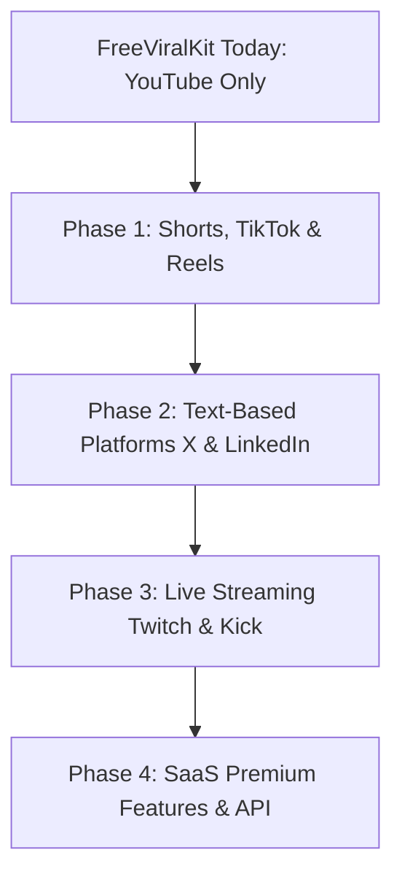

# FreeViralKit: Multi-Platform Expansion & Monetization Roadmap (2026–2027)

Congratulations on the initial milestone! Having **13 pages indexed by Google in just 10 days** is an excellent start for a brand-new domain. It proves that the clean, search-optimized structure (static routing, SSR/SSG pre-rendering, and semantic schema) is working exactly as intended. 

As organic traffic begins to grow, this document outlines the **When, What, How, and Financial Impact** of expanding FreeViralKit from a YouTube-only SEO tool to a multi-platform content creator suite.

---

## 📊 Summary of the Expansion Strategy

---

## 🗓️ Phase-by-Phase Roadmap

### Phase 1: Short-Form Video Domination (Months 1–3)
**Focus:** TikTok, Instagram Reels, and YouTube Shorts. Short-form content has the highest creator density right now.

*   **What to Build:**
    *   **TikTok Hook & Caption Generator:** Generates 5 viral visual hooks (actions) and search-optimized captions with trending hashtags.
    *   **Instagram Reels Hashtag & Audio Optimizer:** Analyzes video concepts to recommend trending audio styles and hashtag clusters.
*   **How it Works (Technical):**
    *   Add `/tiktok-caption-generator` and `/instagram-reels-generator` pages.
    *   Integrate visual hook suggestions into the AI prompt rules (e.g., "suggest a text overlay for the first 1.5 seconds").
*   **Product & Traffic Impact:** 
    *   Attracts high-volume TikTok and Instagram creators.
    *   **Estimated Traffic Increase:** +150% organic search impressions in search engines due to high search demand for TikTok optimization.
*   **Monetization Impact:**
    *   Increases page views for AdSense.
    *   Introduce **affiliate recommendations** for video editing apps (e.g., CapCut, Premiere Pro presets).

---

### Phase 2: Professional & Text-Based Growth (Months 3–6)
**Focus:** X (formerly Twitter) and LinkedIn. These platforms are used heavily by creators to monetize and network.

*   **What to Build:**
    *   **X Thread Writer & Hook Generator:** Turns long YouTube scripts or blog posts into highly engaging 5–10 post X threads.
    *   **LinkedIn Professional Post Formatter:** Optimizes text styling, breaks paragraphs, and generates high-engagement hooks tailored to professional audiences.
*   **How it Works (Technical):**
    *   Add a text-area input for users to paste raw transcripts/scripts.
    *   AI prompt optimization: Focus prompts on copywriting techniques (e.g., AIDA formula, PAS framework).
*   **Product & Traffic Impact:**
    *   Builds B2B credibility for FreeViralKit.
    *   Creators sharing threads generated by the tool will naturally cross-promote FreeViralKit (adding a small credit link like "Generated via FreeViralKit").
*   **Monetization Impact:**
    *   Higher CPM ads (LinkedIn/B2B traffic commands higher ad bids than general entertainment traffic).
    *   **Affiliate Integration:** Link to newsletters (e.g., Beehiiv, ConvertKit) and B2B software.

---

### Phase 3: Live Stream SEO (Months 6–9)
**Focus:** Twitch, Kick, and YouTube Live. Live streaming has unique metadata needs.

*   **What to Build:**
    *   **Twitch Stream Title Generator:** Focuses on curiosity-driven, high-CTR titles for live notifications (which pop up on viewers' phones).
    *   **Twitch Category & Tag Advisor:** Recommends the best gaming category tags to rank high in Twitch browse feeds.
*   **How it Works (Technical):**
    *   Utilizes Twitch API endpoints to query currently popular categories and suggest tags.
*   **Product & Traffic Impact:**
    *   Draws the gaming and live-streaming community.
    *   Increases user retention (streamers often keep the tool open on their second monitor while setting up their stream).
*   **Monetization Impact:**
    *   **Affiliate Integration:** Direct links to streamer gear (microphones, cameras, capture cards, lighting) via Amazon Associates. **This is a major revenue stream.**

---

### Phase 4: The SaaS Premium Transition (Months 9–12)
**Focus:** Transitioning from a free ad-supported platform to a hybrid Freemium SaaS model.

*   **What to Build:**
    *   **Creator Dashboard & Projects:** Allow logged-in users to save their generated titles, descriptions, and hashtags into folders (Projects).
    *   **Bulk SEO Optimizer:** Upload a CSV of 50 video ideas and generate metadata for all of them in one click.
*   **How it Works (Technical):**
    *   Integrate database support (e.g., Supabase or PostgreSQL).
    *   Integrate authentication (NextAuth or Clerk) and payments (Stripe).
*   **Product & Traffic Impact:**
    *   Turns casual visitors into registered users, building a highly valuable email newsletter list.
*   **Monetization Impact:**
    *   **Direct Subscription Income:** $9/month for unlimited generations, bulk uploads, and historical saving.
    *   **Estimated Revenue:** Even a 1% conversion rate on 50,000 monthly visitors yields $4,500/month in recurring software revenue.

---

## 💰 Monetization Model & Financial Projections

To maximize profits, FreeViralKit should use a **hybrid monetization stack**:

| Revenue Stream | How It Works | Time to Implement | Earnings Potential |
| :--- | :--- | :--- | :--- |
| **Google AdSense** | Displays display, in-article, and anchor ads across tools and blogs. | Immediately (after AdSense approval) | $200 – $2,000 / month (scales with traffic) |
| **Affiliate Marketing** | Embeds contextual links to tools (e.g., hosting, video editors) and gear. | Month 2 onwards | $500 – $5,000 / month |
| **Sponsorships** | Partnering with companies (e.g., thumbnail designers, music libraries) for banner spots. | Month 6 onwards | $1,000 – $5,000 / sponsor |
| **Premium Membership** | Monthly subscription ($9/mo) for bulk features and ad-free experience. | Month 9 onwards | $3,000 – $15,000+ / month |

---

## 🚀 SEO and Growth Strategy

To ensure traffic grows steadily, the platform needs the following growth loops:

1.  **Programmatic SEO (pSEO):**
    *   Automatically generate niche pages like `/tools/youtube-title-generator-for-cooking`, `/tools/youtube-title-generator-for-fitness`, etc.
    *   Google will index these specific long-tail pages, giving you easy rankings since they have very low competition.
2.  **Sitemap Auto-Pings:**
    *   We have dynamic sitemaps. Let's add an API ping to search engines on deploy to let them know new pages are ready.
3.  **Newsletter Marketing:**
    *   Collect emails for a weekly "Creator Growth Tip" newsletter. You can sell ad space in this newsletter directly to sponsors.
